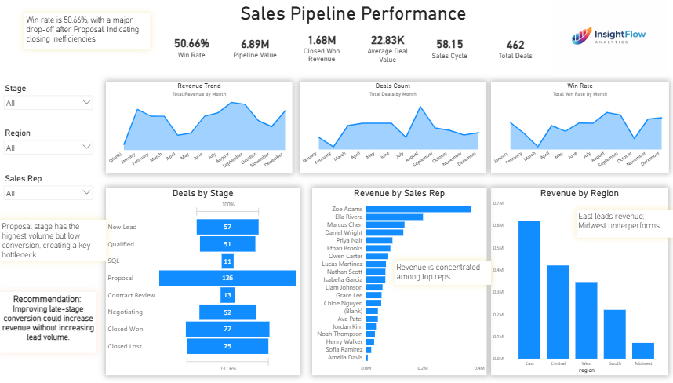
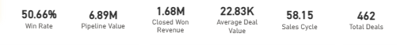
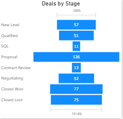

# Sales Pipeline Performance Analysis

## Overview

This project analyzes sales pipeline performance to identify bottlenecks, evaluate conversion efficiency, and highlight revenue trends across regions and sales representatives.

The goal is to understand why deals are not closing and provide insights to improve overall sales performance.

---

## Tools Used

* **Excel** – Data cleaning and preparation
* **SQL** – Data analysis and business insights
* **Power BI** – Dashboard creation and visualization

---

## Key Metrics

* **Win Rate:** 50.66%
* **Total Pipeline Value:** $6.89M
* **Closed Won Revenue:** $1.68M
* **Average Deal Size:** $22.83K
* **Sales Cycle Length:** 58 days
* **Total Deals:** 462

---

## Business Questions

* Where are deals dropping off in the pipeline?
* Which stages contain the most deals?
* Which regions generate the most revenue?
* Which sales representatives drive the most revenue?
* Which lead sources perform best?

---

## Key Insights

* The dataset contains **462 total deals**, representing the full sales pipeline.
* The **Proposal stage holds the highest number of deals and largest pipeline value**, indicating a major bottleneck before closing.
* There is a **significant drop-off after the Proposal stage**, suggesting inefficiencies in late-stage conversion.
* The **East region generates the highest revenue**, while other regions underperform.
* Revenue is **concentrated among top-performing sales reps**, indicating performance gaps.
* **Cold calling is the most effective lead source**, producing the highest revenue and win rate.
* The **SQL stage has the highest average deal value**, suggesting high-value deals are identified early.
* The average time to close a deal is **54 days**, highlighting the length of the sales cycle.
* A small number of deals have **missing lead source data**, indicating a data quality issue.

---

## Dashboard Preview

---

## Key Visuals

### KPI Metrics

### Deals by Stage

---

## Data Model

The dataset was structured using a relational model to support accurate analysis:

* The **deals table** acts as the primary fact table
* The **sales_reps table** provides contextual information
* A **stage mapping table** ensures correct stage ordering in visuals

---

## SQL Analysis

SQL was used to extract insights and answer key business questions.

### Key Queries:

* Total deals in pipeline
* Pipeline value by stage
* Win rate calculation
* Revenue by region and sales rep
* Sales rep ranking using window functions
* Lead source performance and win rate comparison
* Average deal value by stage
* Average time to close

📄 View SQL queries: [analysis_queries.sql](sql/analysis_queries.sql)

---

## Files Included

* Dataset (Excel)
* SQL queries
* Power BI dashboard
* Dashboard screenshots

---

## Summary

This project demonstrates how data can be used to identify sales inefficiencies, improve conversion rates, and support better business decision-making through structured analysis and visualization.
